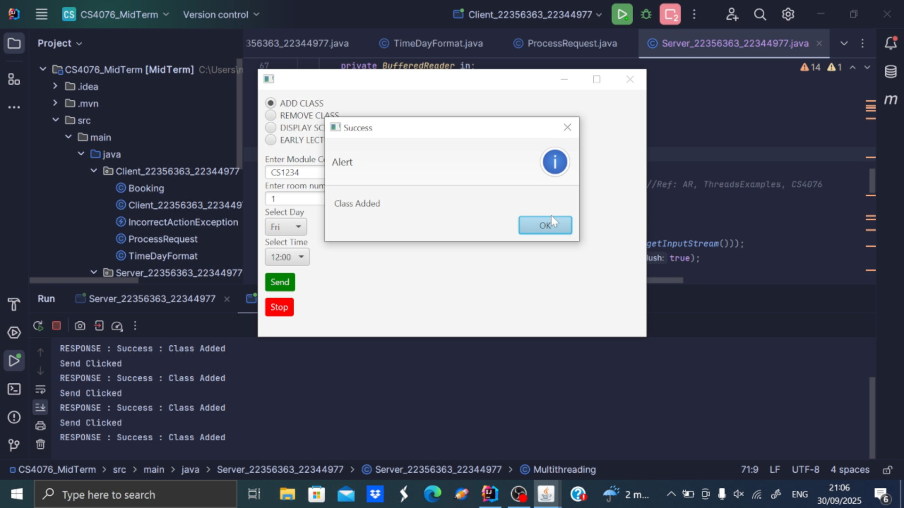
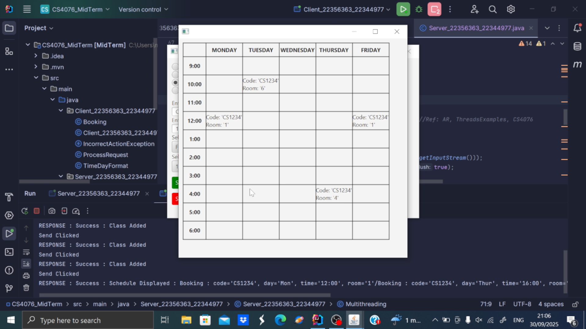
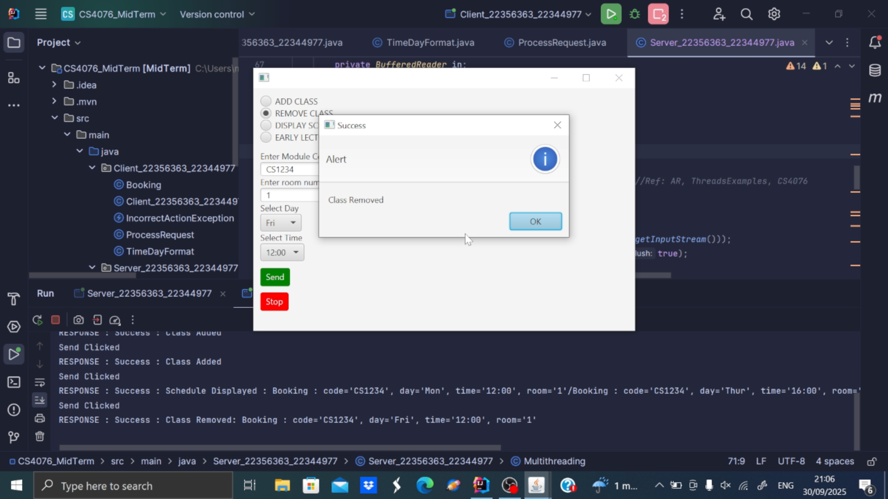
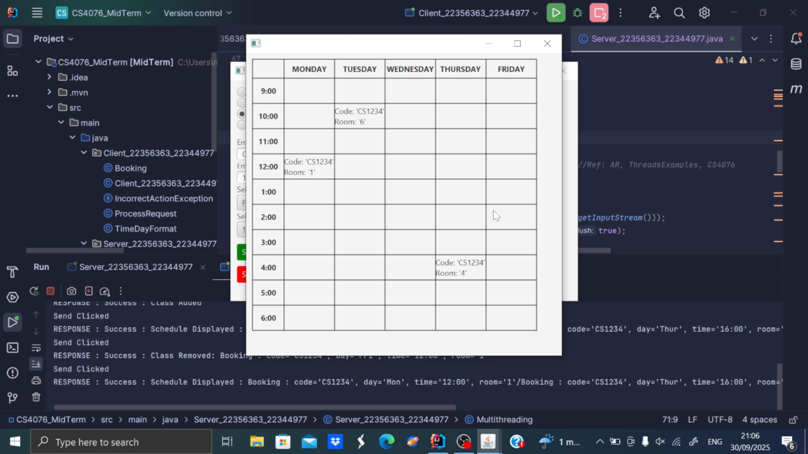

# Class Scheduler Application – CS4076 Event-Driven Programming Project

This pair project is a **TCP protocol-based client-server service** for scheduling classes. It consists of two applications:  

- **Client Application**: A GUI-based app used to send class scheduling requests to the server.  
- **Server Application**: A console-based app that stores schedules, handles requests, and responds to the client.  

The communication protocol is message-based, with alternating send/receive actions. The client initiates a request, the server performs the action, and responds. The connection is terminated when the client presses the **STOP** button, after which the server sends a **TERMINATE** message and closes the connection.  

All operations use **exception handling**, including a custom `IncorrectActionException` thrown when an invalid action format is detected.  

---

## Key Features

- **Add Class**: Schedule a class at a specified date, time, and room. Detects and prevents scheduling clashes.  
- **Remove Class**: Remove a class from the schedule and free the corresponding time slot.  
- **Display Schedule**: View the full schedule for a specific class (console output).  
- **Early Lecture Feature**: Reschedule a class to an earlier time in the day if no clashes exist.  

---

## Development

- **Language**: Java (Event-Driven Programming & TCP Sockets)  
- **Client GUI**: Swing-based GUI controls for input and displaying responses  
- **Server**: Console-based memory collection (ArrayList, HashMap) for schedules  
- **Exception Handling**: Custom `IncorrectActionException` for invalid actions  
- **Communication Protocol**: TCP client-server, alternating message exchange  

---

## Project Deliverables

- Java source code (each class in a separate file)  
- GUI-based Client application  
- Console-based Server application  
- Custom exception implementation (`IncorrectActionException`)  
- TCP message-based client-server communication  
- Demonstrative screenshots and GIF  
- GitHub repository for source code version management  

---

## Screenshots

**Adding a Class to the Schedule**  
  

**Schedule after Adding Class**  
  

**Removing a Class from the Schedule**  
  

**Updated Schedule after Removal**  
  

**Early Lecture Feature Demo**  
  
*Demonstrates scheduling a class earlier in the day if no clashes exist, then updating the timetable.*
